# Hospital-Management-System

## Project is not completed

The aim project was helps manage the information related to health care and patient can book appointment, registration it self , doctor can login and check the patient details. Admin and doctor can manage hospital using this project. Admin and doctor can see the patient history of records.

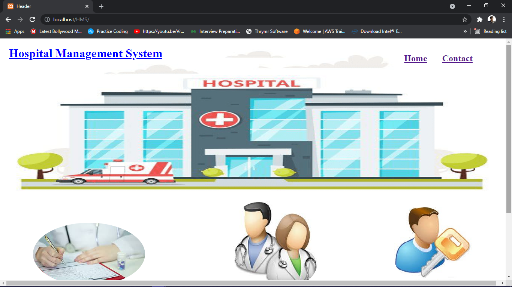</img>

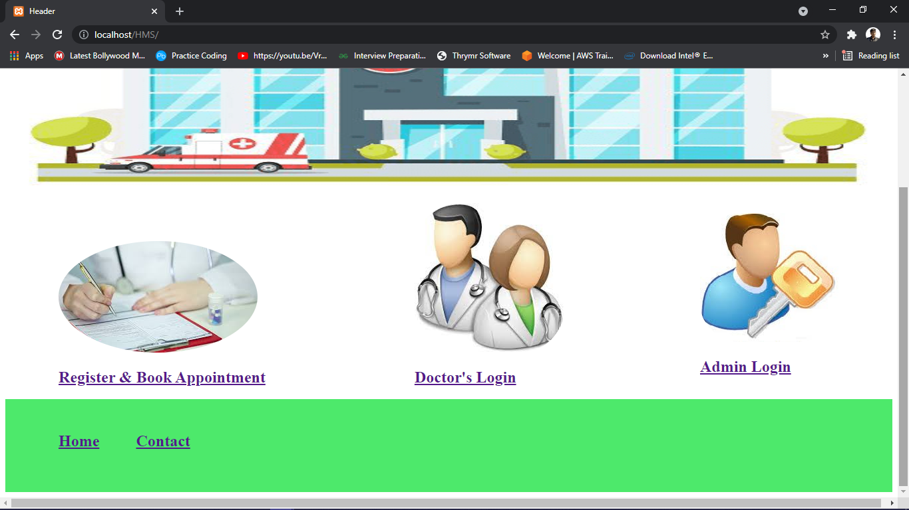</img>

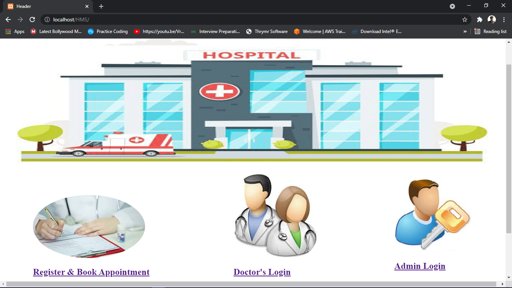</img>

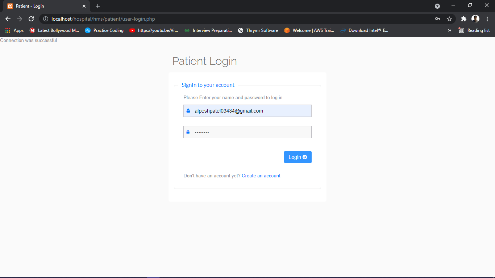</img>

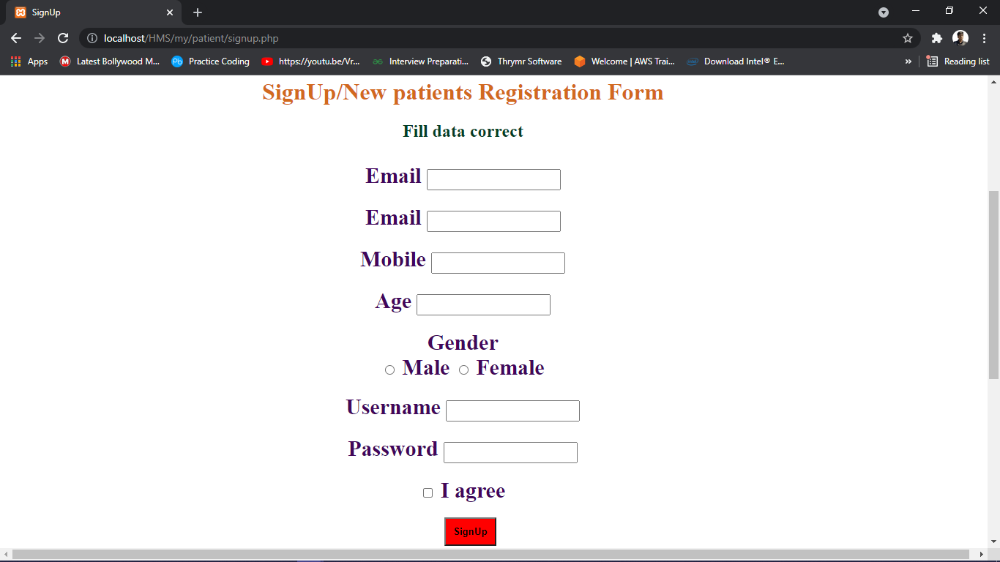</img>

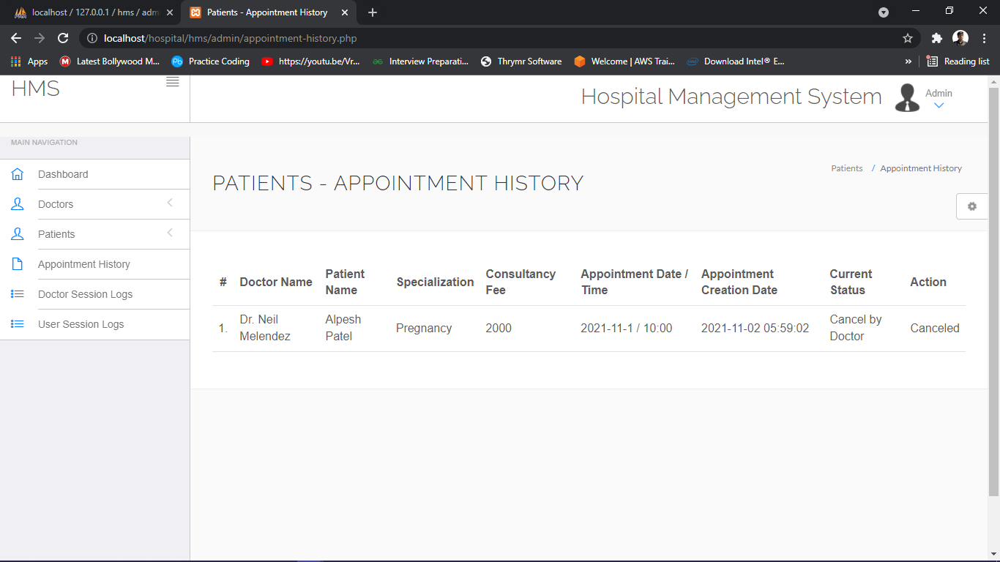</img>

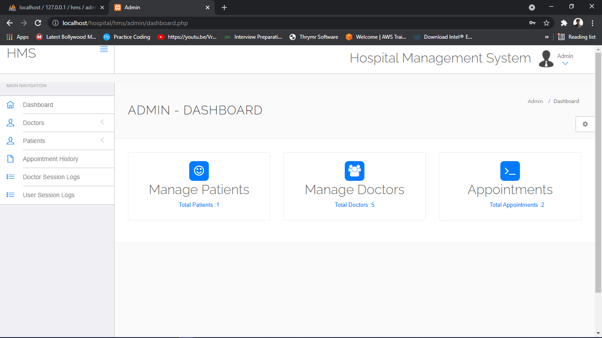</img>

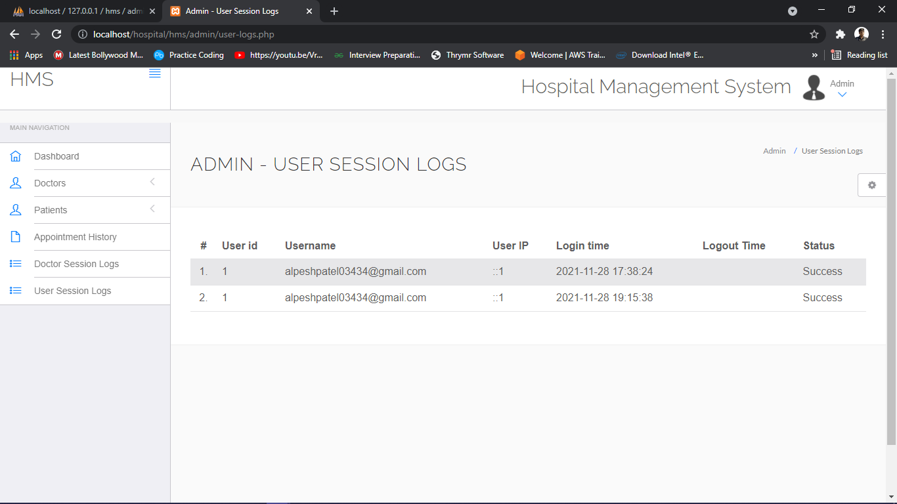</img>

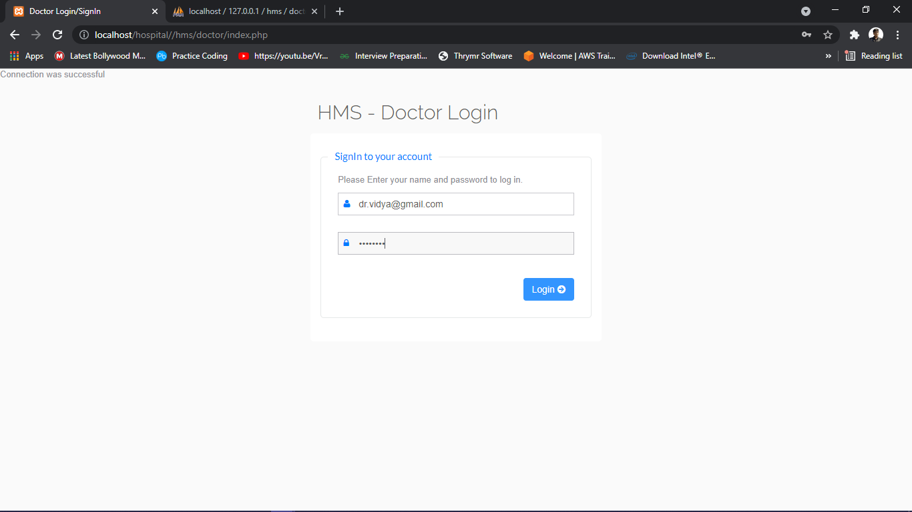</img>

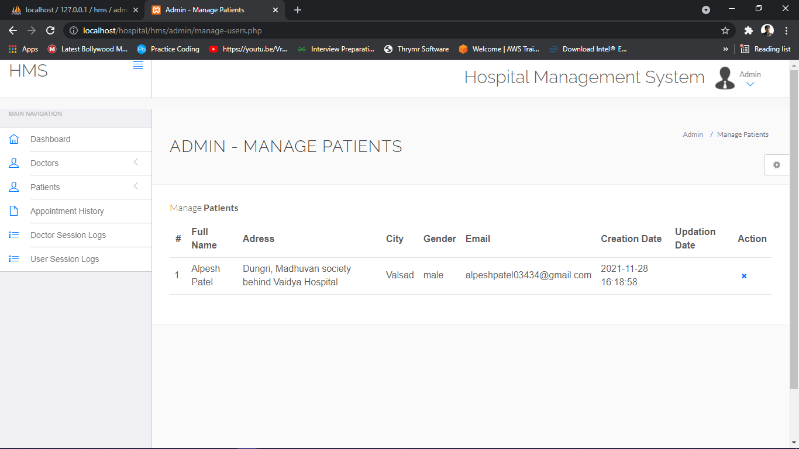</img>

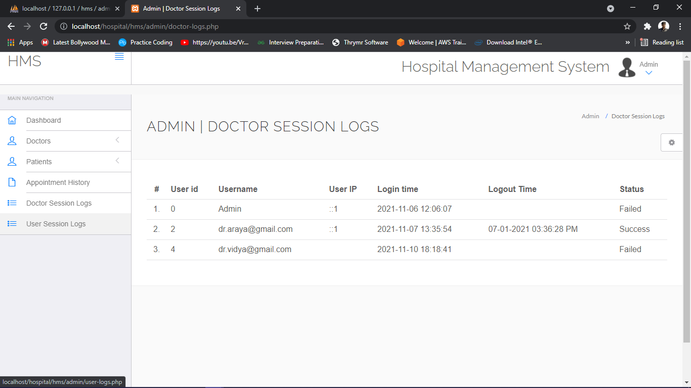</img>
