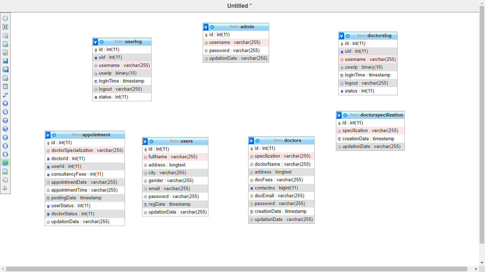

# HMS - Hospital-Management-System

This project can help to the hospital management . This project can Handling patient bills and appointment,  history of appointments, the availability of doctors, fee charge of each specialist doctor, Doctors details.

The aim of the project can help manage the information related to health care and manage hospital. This project make easy and save money. Patient can book appointment as per his/her time and patient can also see the availability of doctors and his/her feel so it's made easy for Patient.

#### Developed an Hospital Management System using html, css, javascript, php, mySQL, Bootstrap

HMS was introduced to solve the complications coming from managing all the paper works of every patient associated with the various departments of hospitalization with confidentiality. HMS provides the ability to manage all the paperwork in one place, reducing the work of staff in arranging and analyzing the paperwork of the patients. HMS does many works like:

- Maintain the medical records of the patient  
- Maintain the contact details of the patient
- Keep track of the appointment dates
- Save the insurance information for later reference
- Tracking the bill payments.

### MySQL designe

</img>

</img>

</img>

</img>

</img>

</img>

</img>

</img>

</img>

</img>

</img>

</img>
